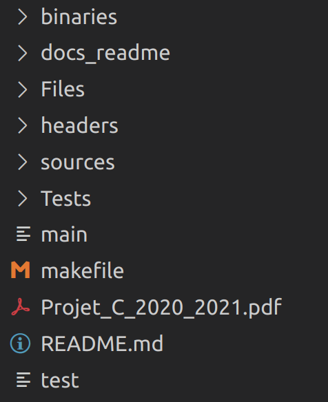

# Projet C

Ce projet est réalisé dans le cadre du cours de Programmation Avancée Impérative de l'ENSTA Bretagne.
Ce projet est réalisé en binôme, les auteurs de ce projet sont Corentin Goetghebeur et Chris Arridi.

## Objectif
Ce projet a pour objectif la mise en place de structures et fonctions permettant la simulation d'un système bancaire.
Pour plus de détails sur ce projet, consulter Projet_C_2020_2021.pdf.

## Téléchargement / Installation
Ce projet est disponible sur GitHub à l'adresse: https://github.com/CorentinGoet/C_Project.git. L'exécutable compilé **main** devrait déjà être utilisable dans l'état ou vous l'avez téléchargé.

### Compilation
Si vous effectuez des modifications sur le projet, vous pouvez compiler le projet en utilisant le makefile.
```bash
make
```
En exécutant cette commande, vous produirez deux exécutables, **main** et **test**.

## Utilisation
Une fois le projet compilé, vous pouvez l'exécuter avec **main**.
```bash
./main
```


## Test
Le deuxième exécutable généré par la compilation est un pseudo test unitaire permettant de vérifier que les fonctions se comportent comme prévu.

<p align=center>ATTENTION !<p>

L'exécution de ce test créée des fichiers de comptes et les ajoute au registre (voir paragraphe structure).
```bash
./test
```


Vous pouvez afficher une version plus détaillée des tests en fournissant un paramètre non nul.

```bash
./test 1
```

## Structure
Le dossier du projet est organisé de la manière suivante:



* Headers : contient tous les fichiers d'en-tête du projet.
* Sources : contient tous les fichiers sources en C.
* Files : contient les fichiers nécessaires à l'éxécution de **main**. Il contient:
    * Le fichier _registre_ qui correspond au registre de la banque. Il liste les numéros de comptes et les nom associés.
    * Le dossier _comptes_ qui contient les comptes des clients (chaque compte est représenté par un fichier).
* Tests : contient une partie des fichiers nécessaires à l'execution de **test**.
* docs_readme: contient les images de README.md.


## Modifications apportées
Plusieurs libertées ont été prises par rapport au sujet (détaillé dans le fichier Projet_C_2020_2021.pdf).

### Format d'écriture dans les fichiers
Le sujet suggère d'écrire directement les structures construites dans le projet au format binaire à l'aide de la fonction `fwrite`. Nous avons choisi un écriture au en texte formaté pour tous les fichiers du projet (fonction `fprintf`).
Par exemple, sur un fichier de compte:


Sur la première ligne, on peut voir l'écriture d'un en-tête de compte (module _entete.h_): les information contenues dans cet en-tête sont une date (donc ici 3 entiers) et un solde.

Sur les autres lignes, on peut voir l'écriture d'une transaction, soit une date, un montant et un label précédé de sa taille.


